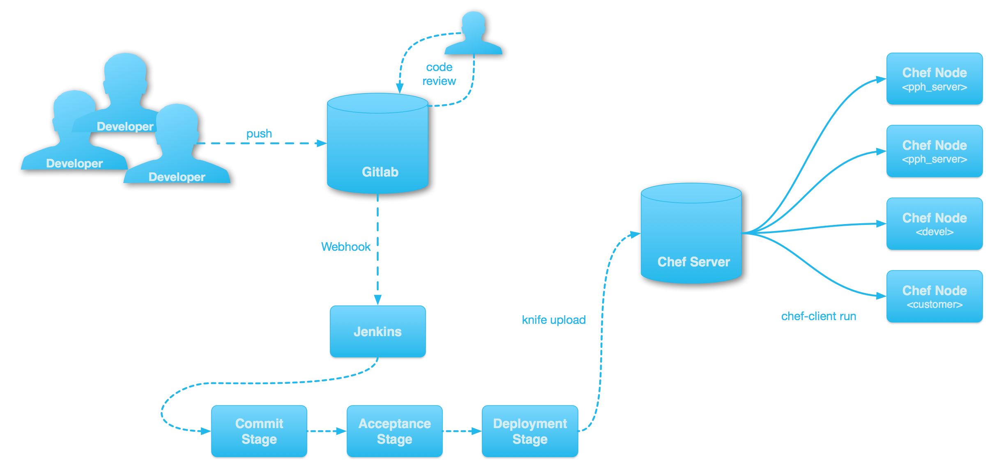

!SLIDE section_slide
# Chef

## IT Automation Framework

!SLIDE
# Chef Characteristics

* Ruby as scripting language
* Sequential order of execution
* Client server or standalone

!SLIDE section_slide
# Chef Terminology

* Nodes
* Cookbooks, Recipes, Resources
* Attributes
* Data Bags
* Chef Client &amp; Chef Server

!SLIDE
# Nodes

* A machine managed by Chef
* can be a physical machine, a virtual machine, a cloud instance or a container
* is converged into desired state
* requires a Chef client

!SLIDE
# Cookbooks

* Define your **tasks**
  * e.g. install a package, create user
* organized in **recipes**
* using **resources** to describe desired state

!SLIDE
# Idempotency

* Basic idea `f(f(x)) == f(x)`
* Executing cookbooks more than once does not change desired state

!SLIDE
# Attributes

* Information about your node
  * e.g. hostname, user name, log directory
* **defaults** are defined in cookbooks
* **composed** according to priority levels

!SLIDE
# Data Bags

* Shared **global data**
* information that needs to be shared between more than one node
* formatted in **JSON**

!SLIDE
# Chef Client

* Brings nodes to desired configuration
* `chef-client` for client/server mode
* `chef-solo` for standalone mode

!SLIDE
# Chef Server

* Storage for Cookbooks, Data Bags, Nodes ...
* Used to ship with a GUI
  * now only free up to 25 nodes
* Provides REST API

!SLIDE section_slide
# Cookbook Implementation

!SLIDE code_slide
# Anatomy of a Cookbook

    @@@
    cookbooks/cookbook_name
    ├── attributes
    │   └── default.rb
    ├── recipes
    │   └── default.rb
    ├── README.md
    └── metadata.rb

!SLIDE code_slide
# metadata.rb

    @@@ ruby
    name             'cookbook_name'
    maintainer       'Great Developer'
    maintainer_email 'developer@maii.com'
    license          'all_rights'
    description      'Does great stuff'
    long_description 'Longer description'
    version          '0.1.1'

    supports 'ubuntu'

!SLIDE code_slide
# Recipe Example

    @@@ ruby
    # Install a few packages
    package 'vim' do
      action :install
    end

    package 'ntp' do
      action :install
    end

    package 'git' do
      action :install
    end

!SLIDE section_slide
# Wait... we have Ruby?!?

!SLIDE code_slide
# Refactored Recipe

    @@@ ruby
    ['vim', 'ntp', 'git'].each do |pkg|
      package pkg do
        action :install
      end
    end

!SLIDE code_slide
# Attributes

    @@@ ruby
    node.default['default_packages'] = \
      ['vim', 'ntp', 'git']

!SLIDE code_slide
# Re-Refactored Recipe

    @@@ ruby
    node['default_packages'].each do |pkg|
      package pkg
    end

!SLIDE code_slide

!SLIDE code_slide
# Data Bags

    @@@
	databags          # data bags dir
	└─ users          # data bag name
		├─ ry21.json  # data bag item
		├─ ry32.json  # data bag item
		└─ ry96.json  # data bag item

!SLIDE code_slide
# Data Bag Items

    @@@ javascript
    {
      "id":      "ry32",
      "name":    "Michael Lihs",
      "home":    "/home/ry32",
      "ssh_keys: ["key_1", "key_2"]
    }

!SLIDE code_slide
# Using Data Bags in Recipes

    @@@ ruby
    data_bag('users').each do |username|
      user_config = \
        data_bag_item('users', username)

      user_account user_config['id'] do
        home         '/home/' + user_config['id']
        create_group true
        ssh_keygen   false
        action       :create
        ssh_keys     user_config['ssh_keys']
      end
    end

!SLIDE
# Running Chef Client

* Chef Client needs to know, where
  * to find cookbooks
  * to find databags
  * to store cache files

* Therefore we need a configuration file

!SLIDE code_slide
# solo.rb - Chef Client Configuration

	@@@ ruby
	current_dir = File.dirname(__FILE__)

	file_cache_path "/var/chef-cache"
	cookbook_path ["#{current_dir}/cookbooks"]
	data_bag_path "#{current_dir}/databags"
	ssl_verify_mode :verify_none

!SLIDE code_slide
# Running Chef Client

    @@@
    sudo /usr/bin/chef-client -z  \
      -o recipe[cookbook::recipe] \
      -c /var/vagrant/solo.rb

!SLIDE code_slide
# Debugging Chef Client Runs

    @@@
    sudo /usr/bin/chef-client -z  \
      -o recipe[cookbook::recipe] \
      -c /var/vagrant/solo.rb \
      -l debug

!SLIDE section_slide
# Community Cookbooks &amp; Berkshelf

* Many community cookbooks available
* Using submodules is a bad idea
* Berkshelf is (more than) a dependency manager

!SLIDE code_slide
# Cookbook Dependencies in metadata.rb

    @@@ ruby
    # ... other stuff ...

    depends 'cookbook_name'

!SLIDE code_slide
# The Berksfile

    @@@
    cookbooks/cookbook_name
    ├── attributes
    │   └── default.rb
    ├── recipes
    │   └── default.rb
    ├── Berksfile
    ├── README.md
    └── metadata.rb

!SLIDE code_slide
# Configuring Berkshelf

    @@@ ruby
    source "https://supermarket.chef.io"

    metadata

!SLIDE code_slide
# Vendoring Dependencies

    @@@ sh
    berks vendor \
      -b cookbooks/cookbook_name/Berksfile \
      berks-cookbooks

!SLIDE code_slide
# Adapting solo.rb

    @@@ ruby
    # ... other stuff ...

    cookbook_path ["/var/vagrant/berks-cookbooks"]

!SLIDE
# Testing Chef Cookbooks

* Code Linting using Foodcritic
* Unit Tests using ChefSpec
* Acceptance Tests using ServerSpec

!SLIDE code_slide
# ChefSpec Test

    @@@ ruby
    describe 'app_chef_node::default' do
      let(:chef_run) do
       ChefSpec::SoloRunner \
         .converge(described_recipe)
      end

      it 'creates directory `/etc/chef`' do
        expect(chef_run) \
          .to create_directory('/etc/chef')
      end

      it 'creates file `/etc/chef/client.rb`' do
        expect(chef_run) \
          .to create_file('/etc/chef/client.rb') \
          .with(mode: 0644)
      end
    end

!SLIDE code_slide
# ServerSpec Test

    @@@ ruby
    describe service('mysql-server') do
     it { should be_enabled }
     it { should be_running }
    end

    describe port(3306) do
     it { should be_listening }
    end

!SLIDE
# Continuous Integration 	 with Chef

