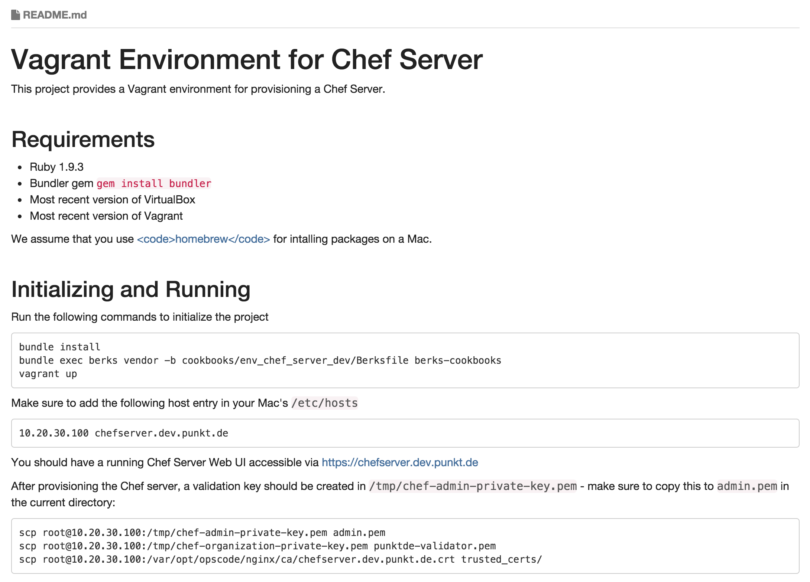

!SLIDE section_slide

# "PRO-Tips"

!SLIDE
# Community Cookbooks

* Different quality
* Use Berkshelf for dependency management
* Pin the version
* Great example: the `jenkins` cookbook

!SLIDE
# Multiple Boxes in one Environment

* Set up a whole cluster with one Vagrantfile
* Examples:
  * Jenkins master / slave setups
  * CoreOS / Kubernetes clusters
  * Chef Server and Nodes

!SLIDE
# Examples for multi-machine Vagrantfiles

* [Kubernetes with Vagrant](https://github.com/GoogleCloudPlatform/kubernetes/blob/master/docs/getting-started-guides/vagrant.md)
* [Chef Server 12 with Vagrant](http://misheska.com/blog/2014/11/25/chef-server-12/)
* [Jenkins Cookbook](https://github.com/opscode-cookbooks/jenkins)

!SLIDE
# NFS Shares

* VirtualBox shared folders are slow
* tuning shares with NFS

!SLIDE
# File Caches

* NFS is fast in reading
* it's slow in writing
* keep cache files in the box

!SLIDE
# Cookbook Documentation

* `knife` plugin `cookbook doc`
* create your own template
* makes use of Rubydoc and Metadata

!SLIDE

!SLIDE
# Rake Tasks

* Use Rake for repeated tasks
* upload cookbooks
* create documentation
* run tests
* linting

!SLIDE code_slide

    @@@
    $ rake -T

    rake cookbook:chefspec[name]
        # Runs ChefSpec tests
    rake cookbook:foodcritic[name]
        # Runs Foodcritic linting
    rake cookbook:readme[name]
        # Generate README.md files
    rake cookbook:test[name]
        # Runs knife cookbook test
    rake cookbook:upload[name]
        # Upload cookbook(s)
